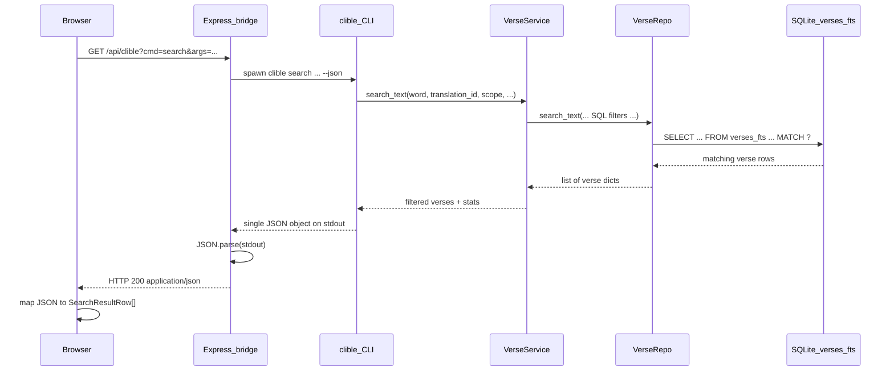

# FTS5 search: path from browser to SQLite and back

This document describes what happens when you run a **text search** (FTS5 Search) in the web UI—not verse lookup. The UI label is **FTS5** (SQLite full-text search); it is not a separate “FST5” algorithm.

## End-to-end flow

## 1. Browser (React)

- User selects **FTS5 Search**, enters a word, and submits.
- [`App.tsx`](App.tsx) calls `bibleRepository.search(query, translationId)`.
- [`repositories/bibleRepository.ts`](repositories/bibleRepository.ts) builds the same argument string the CLI would use, e.g. `"mountain" -t web`, and requests:

  `GET /api/clible?cmd=search&args=<url-encoded-args>`

- In **development**, the repository logs lines prefixed with `[clible-web] search:` (URL, HTTP status, JSON keys, row count). Production builds omit these (`import.meta.env.DEV` is false).

## 2. Express bridge ([`server.ts`](server.ts))

- Parses `cmd` and `args`, tokenizes `args` safely, then runs:

  `clible search <tokens...> --json`

  (`--json` is appended by `buildClibleArgv` for `search`.)
- Waits for the child process. **Expects `stdout` to be a single JSON document** (no extra Rich text). It runs `JSON.parse(stdout)` and responds with `res.json(parsed)`.
- If `stdout` is not valid JSON (for example old behavior: “No verses found…” as plain text), the bridge returns **500** with `{ error: "Invalid JSON output from Clible CLI", rawOutput: stdout }`.
- In **non-production**, the server logs `[clible-web] bridge:` lines: full argv, stdout/stderr lengths, parsed top-level keys, or a warning with the first 200 characters of stdout when JSON parsing fails.

## 3. CLI (`clible search`)

- [`commands/search.py`](../../clible/commands/search.py) loads `VerseService` and calls `search_text(...)`.
- For **`--json`**:
  - If there are **no matches**, it still prints a valid JSON object (empty `verses` array) so the bridge never sees non-JSON stdout.
  - If there are matches, it prints the same schema via `export_verses_bundle(..., format="json")`.

## 4. Service and repository (Python)

- [`VerseService.search_text`](../../clible/services/verse_service.py) resolves scope (bible / book / chapter / …) and calls [`VerseRepo.search_text`](../../clible/db/repositories/verse_repo.py).
- `VerseRepo.search_text` runs SQL against the **`verses_fts`** FTS5 virtual table (and joins `verses` for full rows). The `MATCH` clause uses the search word; optional filters narrow by `translation_id`, book, chapter, verse range, etc.

## 5. JSON shape at the HTTP boundary

CLI stdout (and thus the HTTP body) is one object, for example:

| Field | Role |
|--------|------|
| `type` | `"search"` |
| `title` | Human-readable title |
| `translation_id` | Active translation id |
| `verses` | Array of `{ book_id, chapter, verse, text }` |
| `query`, `scope`, `scope_ref` | Search parameters |
| `statistics` | Counts and top books |

The React layer **does not** use this object directly as a list. [`mapSearchJsonToRows`](repositories/bibleRepository.ts) turns `verses` into `SearchResultRow[]`: `{ reference, text }` where `reference` is like `JHN 3:16` (book code + chapter:verse).

## 6. Why “Invalid JSON output from Clible CLI” appeared

Previously, **zero results** with `--json` printed only a Rich “No verses found…” line to stdout and returned. That string is not JSON, so the bridge failed at `JSON.parse` and returned the error you saw, with `rawOutput` showing the plain message.

That path is fixed in `search.py` by emitting the same JSON schema with `verses: []` when there are no matches.

## 7. Quick local checks

- Terminal: `clible search mountain -t web --json` — stdout must be one JSON object.
- Server terminal (dev): look for `[clible-web] bridge:` lines when the browser triggers a search.
- Browser console (dev): look for `[clible-web] search:` lines from the repository.
